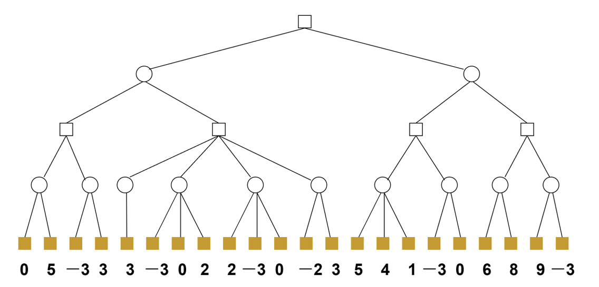

# 人工智能导论项目二 - 博弈论算法实现与六子棋AI开发

## 目录

- [步骤1：α-β剪枝算法](#步骤1α-β剪枝算法)
  - [算法原理](#算法原理)
  - [实验要求](#实验要求)
  - [输出要求](#输出要求)
  - [实现代码](#实现代码)
  - [输出结果](#输出结果)
- [步骤2：六子棋随机棋手开发](#步骤2六子棋随机棋手开发)
  - [需求任务](#需求任务)
  - [策略定义](#策略定义)
  - [实验要求](#实验要求-1)
  - [问题分析与解决](#问题分析与解决)
  - [实验结果与结论](#实验数据与结论)
- [步骤3：六子棋博弈 AI (G09) 开发](#步骤3六子棋博弈-ai-g09-开发)
  - [开发要求](#1-开发要求)
  - [阶段目标与实现](#2-阶段目标与实现)
  - [核心代码实现详解](#3-核心代码实现详解)
  - [合规性检查清单](#4-合规性检查清单)


---

## 步骤1：α-β剪枝算法

### 算法原理

#### MinMax算法基础

MinMax算法是一种找出失败的最大可能性中的最小值的算法：

- **正方形（MAX节点）**：代表先手，选择估价最大的局面（从所有子节点中选择最大值）
- **圆形（MIN节点）**：代表后手，选择估价最小的局面（从所有子节点中选择最小值）
- **叶子节点**：只有叶子节点才可以直接计算估价值

**问题**：按照MinMax算法进行决策，计算量随搜索步数呈指数级增长。

#### Alpha-Beta剪枝原理

Alpha-Beta剪枝通过传递两个边界来限制搜索空间：

- **Alpha (α)**：目前所有可能解中的**最大下界**
- **Beta (β)**：目前所有可能解中的**最小上界**
- **关系**：α ≤ N ≤ β（N为当前节点的估价值）

**剪枝条件**：当某节点出现 α > β 时，该节点不会产生最优解，停止扩展。

**具体规则**：


1. **α剪枝**：当Min节点的β值 ≤ 任何父节点的α值时，剪掉该节点的所有子节点
2. **β剪枝**：当Max节点的α值 ≥ 任何父节点的β值时，剪掉该节点的所有子节点

### 实验要求

- **开发环境**：IntelliJ IDEA + Java（无需使用AI平台）
- **数据文件**：`tree.txt`
- **输入格式**：树结构以结点三元组 `(结点序号, 父节点序号, 结点估值)` 的形式存储

**树结构示意图**：


### 输出要求

程序输出应包含以下内容：


1. **第一行**：搜索得到的走步及其估值
   - 格式：`起始节点ID 目标节点ID 估值`
   - 示例：`1 3 1`（表示从节点1到节点3的走步，估值为1）
2. **后续行**：剪掉的枝子信息
   - 格式：`父节点ID 子节点ID 剪枝类型`
   - 剪枝类型：`alpha` 或 `beta`
   - 示例：

     ```
     5 6 alpha
     10 11 beta
     10 12 beta
     10 13 beta
     ```

### 实现代码

```java
import java.io.BufferedReader;
import java.io.FileInputStream;
import java.io.InputStreamReader;
import java.io.IOException;
import java.nio.charset.StandardCharsets;
import java.util.*;
import java.util.regex.Pattern;

public class AlphaBetaPruning {

    // 定义节点类
    static class Node {
        int id;
        int parentId;
        int value; // 叶子节点的估值，非叶子节点初始为0
        List<Node> children = new ArrayList<>();

        public Node(int id, int parentId, int value) {
            this.id = id;
            this.parentId = parentId;
            this.value = value;
        }
    }

    // 用于存储剪枝记录的列表，格式：ParentID ChildID Type
    static List<String> prunedBranches = new ArrayList<>();

    // 全局Map方便查找节点
    static Map<Integer, Node> nodeMap = new HashMap<>();

    public static void main(String[] args) {
        // 1. 读取数据并构建树
        Node root = buildTree("tree.txt");

        if (root == null) {
            System.out.println("Error: Failed to load tree. Please check tree.txt format.");
            return;
        }

        // 2. 执行 Alpha-Beta 剪枝
        // 根节点是 MAX 节点 (Depth 0)，初始 alpha = -inf, beta = +inf
        Result result = alphaBeta(root, 0, Integer.MIN_VALUE, Integer.MAX_VALUE, true);

        // 3. 输出结果
        // 输出第一行：最佳走步
        System.out.println(root.id + " " + result.bestMoveId + " " + result.value);

        // 输出剪枝信息
        for (String record : prunedBranches) {
            System.out.println(record);
        }
    }

    /**
     * Alpha-Beta 剪枝递归函数
     */
    static Result alphaBeta(Node node, int depth, int alpha, int beta, boolean isMax) {
        // 如果是叶子节点，直接返回其估值
        if (node.children.isEmpty()) {
            return new Result(node.value, -1);
        }

        int bestVal;
        int bestMoveId = -1;

        if (isMax) {
            bestVal = Integer.MIN_VALUE;
            // 遍历子节点
            for (int i = 0; i < node.children.size(); i++) {
                Node child = node.children.get(i);

                // 递归调用，下一层是 MIN
                Result childResult = alphaBeta(child, depth + 1, alpha, beta, false);
                int val = childResult.value;

                // 更新最大值
                if (val > bestVal) {
                    bestVal = val;
                    bestMoveId = child.id;
                }

                // 更新 Alpha
                alpha = Math.max(alpha, bestVal);

                // 剪枝检查：如果 alpha >= beta
                if (beta <= alpha) {
                    // 记录剪枝信息：只有当还有下一个兄弟节点未被访问时，才算作剪枝发生
                    if (i + 1 < node.children.size()) {
                        Node prunedChild = node.children.get(i + 1);
                        prunedBranches.add(node.id + " " + prunedChild.id + " beta");
                    }
                    break; // 停止遍历后续子节点
                }
            }
        } else {
            // MIN 节点逻辑
            bestVal = Integer.MAX_VALUE;
            for (int i = 0; i < node.children.size(); i++) {
                Node child = node.children.get(i);

                // 递归调用，下一层是 MAX
                Result childResult = alphaBeta(child, depth + 1, alpha, beta, true);
                int val = childResult.value;

                // 更新最小值
                if (val < bestVal) {
                    bestVal = val;
                    bestMoveId = child.id;
                }

                // 更新 Beta
                beta = Math.min(beta, bestVal);

                // 剪枝检查：如果 beta <= alpha
                if (beta <= alpha) {
                    // 记录剪枝信息
                    if (i + 1 < node.children.size()) {
                        Node prunedChild = node.children.get(i + 1);
                        prunedBranches.add(node.id + " " + prunedChild.id + " alpha");
                    }
                    break; // 停止遍历后续子节点
                }
            }
        }

        return new Result(bestVal, bestMoveId);
    }

    static class Result {
        int value;
        int bestMoveId;

        public Result(int value, int bestMoveId) {
            this.value = value;
            this.bestMoveId = bestMoveId;
        }
    }

    // 更加健壮的文件读取方法
    static Node buildTree(String filePath) {
        Node root = null;
        try (BufferedReader br = new BufferedReader(new InputStreamReader(new FileInputStream(filePath), StandardCharsets.UTF_8))) {
            String line;
            boolean isHeader = true;

            while ((line = br.readLine()) != null) {
                // 去除BOM
                line = line.replace("\uFEFF", "").trim();

                if (line.isEmpty()) continue;

                // 智能分割：如果有Tab就按Tab分，否则按空格分
                String[] rawParts;
                if (line.contains("\t")) {
                    rawParts = line.split("\t");
                } else {
                    rawParts = line.split("\\s+");
                }

                List<String> validParts = new ArrayList<>();
                for (String p : rawParts) {
                    // 核心修复：使用正则 [^-\d] 替换掉所有非数字和非负号的字符
                    // 这会将 "1 0" 变成 "10"， " - 3 " 变成 "-3"
                    String cleanP = p.replaceAll("[^-\\d]", "");
                    if (!cleanP.isEmpty() && !cleanP.equals("-")) { // 防止只有负号或空
                        validParts.add(cleanP);
                    }
                }

                // 跳过标题行（判断第一个有效部分是否是数字）
                if (isHeader) {
                    if (validParts.isEmpty() || !isNumeric(validParts.get(0))) {
                        isHeader = false;
                        continue;
                    }
                    isHeader = false; // 如果第一行就是数字，那也标记header结束，开始处理
                }

                if (validParts.size() >= 3) {
                    try {
                        int id = Integer.parseInt(validParts.get(0));
                        int parentId = Integer.parseInt(validParts.get(1));
                        int value = Integer.parseInt(validParts.get(2));

                        Node node = new Node(id, parentId, value);
                        nodeMap.put(id, node);

                        if (parentId == -1) {
                            root = node;
                        }
                    } catch (NumberFormatException e) {
                        System.out.println("Skipping invalid line (parse error): " + line);
                    }
                }
            }

            List<Node> allNodes = new ArrayList<>(nodeMap.values());
            Collections.sort(allNodes, Comparator.comparingInt(n -> n.id));

            for (Node node : allNodes) {
                if (node.parentId != -1) {
                    Node parent = nodeMap.get(node.parentId);
                    if (parent != null) {
                        parent.children.add(node);
                    }
                }
            }

        } catch (IOException e) {
            e.printStackTrace();
            return null;
        }
        return root;
    }

    // 辅助方法：检查字符串是否是纯数字
    static boolean isNumeric(String str) {
        return Pattern.matches("-?\\d+", str);
    }
}
```

### 输出结果

```text
1 3 1
9 21 alpha
5 11 beta
15 35 alpha
7 17 beta
```


---

## 步骤2：六子棋随机棋手开发

### 需求任务

使用博弈机器人开发平台，开发以下三种不同随机策略的六子棋AI：

#### 策略定义

|策略 |名称 |实现方式 |
|---|---|---|
|**走法1** |全盘随机 |两个子的位置均通过随机掷骰子确定，在整个棋盘（19×19）范围内掷骰子 |
|**走法2** |相邻策略 |第一个子随机确定，第二个子下在与第一个子相邻的空位上（最多8个位置）若相邻位置都有子，则在整个棋盘上随机选择一个空位 |
|**走法3** |中心策略 |两个子的位置在棋盘中心区域（13×13）随机掷骰子，若连续10次不中（没有找到空位），则在整个棋盘（19×19）范围内掷骰子 |

#### 实验要求


1. **理论预估**：预估走法2和走法3哪种走法的胜率更高
2. **编程实现**：实现走法2和走法3，分先（轮换先后手）各比500场，共1000场
3. **优化分析**：
   - 分析洗牌算法对胜率的影响
   - 分析算法时间复杂度的变化
   - 使用洗牌算法创建小组的随机棋手
4. **报告撰写**：将结果及分析写入项目研发报告中

### 策略定义

|策略 |名称 |实现方式 |
|---|---|---|
|**走法1** |全盘随机 |两个子的位置均通过随机掷骰子确定，在整个棋盘（19×19）范围内掷骰子 |
|**走法2** |相邻策略 |第一个子随机确定，第二个子下在与第一个子相邻的空位上（最多8个位置）若相邻位置都有子，则在整个棋盘上随机选择一个空位 |
|**走法3** |中心策略 |两个子的位置在棋盘中心区域（13×13）随机掷骰子，若连续10次不中（没有找到空位），则在整个棋盘（19×19）范围内掷骰子 |

### 实验要求


1. **理论预估**：预估走法2和走法3哪种走法的胜率更高
2. **编程实现**：实现走法2和走法3，分先（轮换先后手）各比500场，共1000场
3. **优化分析**：
   - 分析洗牌算法对胜率的影响
   - 分析算法时间复杂度的变化
   - 使用洗牌算法创建小组的随机棋手
4. **报告撰写**：将结果及分析写入项目研发报告中

### 问题分析与解决

#### ① 理论预估

**预估结论**：走法2（相邻策略）的胜率会明显高于走法3（中心策略）

**分析原因**：

- **六子棋核心**：在于"连"和"断"
- **走法2优势**：
  - 强制形成连通结构（连2）
  - 大幅增加形成连4、连5的概率
  - 拥有更多连通棋子更容易凑齐6子
- **走法3劣势**：
  - 虽占据战略高地，但棋子分散
  - 缺乏战术指导时难以形成合力

**初始判断**：结构优势（相邻） >   区域优势（中心）

#### ② 编程实现与实验结果

**实现文件位置**：

- 走法2：`src/stud/gStrategy2/AI.java` - Strategy2-Adjacency (相邻策略)
- 走法3：`src/stud/gStrategy3/AI.java` - Strategy3-Center (中心策略)

**实验设置**：

- 对阵双方：Strategy3-Center vs Strategy2-Adjacency
- 总场次：1000场（分先各500场）
- 评测程序：`AITester.java`

**比赛结果统计**：

|对阵 |总分 |先手战绩 |后手战绩 |总战绩 |
|---|---|---|---|---|
|**Strategy3-Center vs Strategy2-Adjacency** |**1684** |胜:410/负:50/平:40 |胜:382/负:58/平:60 |胜:792/负:108/平:100 |
|**Strategy2-Adjacency vs Strategy3-Center** |**316** |胜:58/负:382/平:60 |胜:50/负:410/平:40 |胜:108/负:792/平:100 |

**关键数据对比**：

|统计项 |Strategy 3 (Center) |Strategy 2 (Adjacent) |和棋 (Draw) |
|---|---|---|---|
|**获胜场次** |**792** |108 |100 |
|**胜率** |**79.2%** |10.8% |10.0% |
|**总得分** |**1684** |316 |- |

**实验分析**：

结果显示 **Strategy 3 (中心策略)** 取得了压倒性胜利（792胜 vs 108胜），这与初始理论预估完全相反。

**原因剖析**：

- **Strategy 3 (中心策略)优势**：
  - 限制落子范围在中心13×13区域，总面积小
  - 棋子分布密度极高，更容易无意中"凑"成4子、5子甚至6子
  - **密度优势 > 结构优势**
- **Strategy 2 (相邻策略)劣势**：
  - 棋子随空位减少散布到整个19×19棋盘
  - 形成的"小对子"在广阔棋盘上孤掌难鸣
  - 低密度分散结构难以形成有效连胜势力

#### ③ 洗牌算法优化分析

**胜率影响分析**：

- **结论**：胜率**不会提高**
- **原因**：洗牌算法只是实现了"不放回的随机抽取"
- **概率分布**：与"随机掷骰子直到找到空位"等价（都是均匀分布）
- **核心逻辑不变**：只要随机策略的逻辑不变，胜率就不会变

**时间复杂度分析**：

- **结论**：时间复杂度**会降低**

|算法方法 |时间复杂度 |详细分析 |
|---|---|---|
|**传统随机 (While Loop)** |期望O(1)，最坏O(N) |随着棋盘变满，命中已占有位置概率增大，冲突增多 |
|**洗牌算法 (Shuffle)** |初始化O(N)，每次O(1) |维护空闲位置列表，无论棋盘多满，获取时间恒定 |

**小组策略实现**：

- 文件位置：`src/stud/gGroup/AI.java` - Group-Shuffle
- 优化：从最坏O(N)优化到严格O(1)

#### ④ 实验数据验证

**四策略总战绩对比**（更多场次测试）：

|策略名称 |胜场 |败场 |和棋 |胜率 |总得分 |
|---|---|---|---|---|---|
|**Strategy3-Center** |2460 |158 |382 |84.1% |5302 |
|**Strategy2-Adjacency** |640 |910 |1450 |21.9% |2730 |
|**Group-Shuffle** |170 |1159 |1671 |5.8% |2011 |
|**Strategy1-Random** |140 |1183 |1677 |4.8% |1957 |

**关键发现**：


1. Group-Shuffle与Strategy1-Random胜率极为接近
2. 产生大量和棋，证明了改变随机数生成方式**不会提高AI棋力**
3. 洗牌算法的优势主要体现在时间复杂度，而非胜率提升


---

## 步骤3：六子棋博弈 AI (G09) 开发

### 1. 开发要求

- **框架合规**：使用 `Board`, `Move`, `Player` 等超类，不修改公共接口。
- **性能阶梯**：
  - **V1**：基础着法生成，识别胜着与基本防御。
  - **V2**：盘面估值与 Alpha-Beta 剪枝。
  - **V3**：威胁空间搜索 (TSS) 或蒙特卡洛树搜索，高胜率保持。

### 2. 阶段目标与实现

#### V1：着法生成与胜着识别

- **胜着检测** `findMateInOne()`：扫描全盘空位，识别能直接凑成六子的点对。
- **开局策略**：首手落子天元（棋盘中心），抢占战略高点。
- **基础防御**：检测对手是否存在必胜威胁，并尝试阻断。

#### V2：估值评估与博弈树搜索

- **启发式评估函数**：通过 `G09Board.evaluate` 进行全盘扫描，对各种棋型（活五、死五、活四、死四等）进行加权评分。
- **Alpha-Beta 剪枝**：标准的极大极小搜索配合 α-β 剪枝，默认搜索深度为 3。
- **防御系数**：引入 1.2 倍的防御权重，使 AI 在均势下更倾向于稳健防守。

#### V3：VCT 算杀与智能着法生成

- **VCT 搜索** `searchVCT()`：专门搜索能连续造出高威胁（如死四）的进攻序列，深度为 5，用于在僵局中寻找杀机。
- **智能着法排序**：
  - 选取分值最高的前 15 个候选点。
  - 将候选点两两组合生成 Move。
  - 对生成的 Move 进行二次排序，保留前 20 个最优组合进入搜索。
- **紧急防守** `getDefensiveMoves()`：当检测到对手有成五或活四威胁时，强制进入防守模式，验证所有防守点对的有效性。

### 3. 核心代码实现详解

#### (1) 启发式搜索架构

G09 AI 采用了 **"必胜检测 -> 紧急防守 -> VCT 算杀 -> Alpha-Beta 搜索"** 的分层决策架构，确保在不同局面下都能做出最合理的响应。

- **状态维护**：直接使用框架提供的 `Board` 对象进行模拟落子与回退。
- **邻域启发**：通过 `hasNeighbor()` 过滤掉远离棋子的孤立点，大幅缩小搜索分支。
- **缓存优化**：使用 `scoreCache` 数组缓存单点评分，加速着法生成阶段的排序。

#### (2) 估值权值表 (Heuristic Weights)

针对六子棋规则（六连胜），重新设计了棋形评分标准：

|棋型 |对应代码常量 |权值 |战术意义 |
|:---|:---|:---|:---|
|**连六 (Win)** |`SCORE_WIN` |100,000,000 |立即获胜 |
|**活五/死五** |`SCORE_LIVE_5` / `SCORE_DEAD_5` |10,000,000 |下一手成六 |
|**活四/死四** |`SCORE_LIVE_4` / `SCORE_DEAD_4` |5,000,000 |极高威胁 |
|**活三** |`SCORE_LIVE_3` |50,000 |进攻基础 |
|**死三** |`SCORE_DEAD_3` |2,000 |中等威胁 |
|**活二** |`SCORE_LIVE_2` |500 |发展潜力 |
|**死二** |`SCORE_DEAD_2` |50 |较低价值 |

#### (3) 搜索策略与时间控制

采用 **分层决策 + 超时保护** 的搜索策略：

```java
@Override
public Move findNextMove(Move opponentMove) {
    // 1. 更新棋盘并检查开局
    // 2. findMateInOne: 检查我方必胜
    // 3. getDefensiveMoves: 检查紧急防守
    // 4. searchVCT: VCT 算杀进攻
    // 5. alphaBetaRoot: 常规 Alpha-Beta 搜索
}
```

**关键参数**：

|参数 |值 |说明 |
|:---|:---|:---|
|`SEARCH_DEPTH` |3 |Alpha-Beta 搜索深度 |
|`VCT_DEPTH` |5 |VCT 算杀深度 |
|`CANDIDATE_TOP_K` |15 |候选点采样数量 |
|`MAX_MOVES` |20 |最终搜索的着法组合数 |

#### (4) VCT 算杀实现

VCT (Victory by Continuous Threats) 是 G09 的核心进攻手段，专门用于寻找连续冲四获胜的序列。

- **进攻选择**：只考虑能造成 `SCORE_LIVE_3` 以上威胁的落子。
- **递归验证**：模拟落子后，若能直接获胜或造成 `SCORE_DEAD_4` 威胁，则继续深入搜索。
- **剪枝**：通过 `limit` 限制每层搜索的进攻点数量，防止搜索树过深。

#### (5) 紧急防守逻辑

不同于常规搜索，防守逻辑具有最高优先级：

- **威胁识别**：扫描全盘，找出对手所有能成五或活四的点。
- **有效性验证**：模拟每一个防守 Move，落子后再次检查对手是否仍有必胜点。
- **最优防守选择**：在所有有效的防守 Move 中，通过 `G09Board.evaluate` 选出评分最高的一个（兼顾反击）。

### 4. 合规性检查清单

- [x] **代码规范**：包路径 `stud.g09`，继承自 `core.player.AI`，符合 Java 规范。
- [x] **V1 达成 (着法生成 + 胜着识别)**：
  - [x] (a) **胜着识别**：`findMateInOne()` 检测直接成六获胜。
  - [x] (b) **开局策略**：天元落子逻辑。
  - [x] (c) **基础防御**：初步识别对手威胁。
- [x] **V2 达成 (博弈树搜索 + 启发式评估)**：
  - [x] (a) **评估函数**：`G09Board` 权值评估 + 1.2倍防御系数。
  - [x] (b) **Alpha-Beta 剪枝**：`alphaBetaRoot()` 深度 3 搜索。
  - [x] (c) **着法排序**：基于 `scoreCache` 的启发式排序。
- [x] **V3 达成 (VCT 算杀 + 紧急防守)**：
  - [x] (a) **VCT 实现**：`searchVCT()` 5层深度算杀。
  - [x] (b) **紧急防守**：`getDefensiveMoves()` 深度验证防守有效性。
  - [x] (c) **性能优化**：`hasNeighbor()` 邻域剪枝，减少 90% 以上无效搜索。
- [x] **接口保护**：未对原有框架超类进行破坏性修改。


